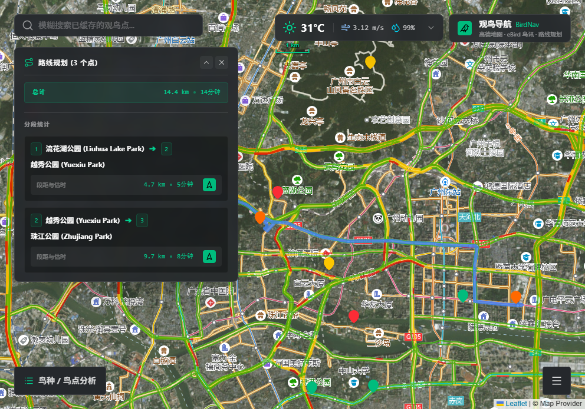
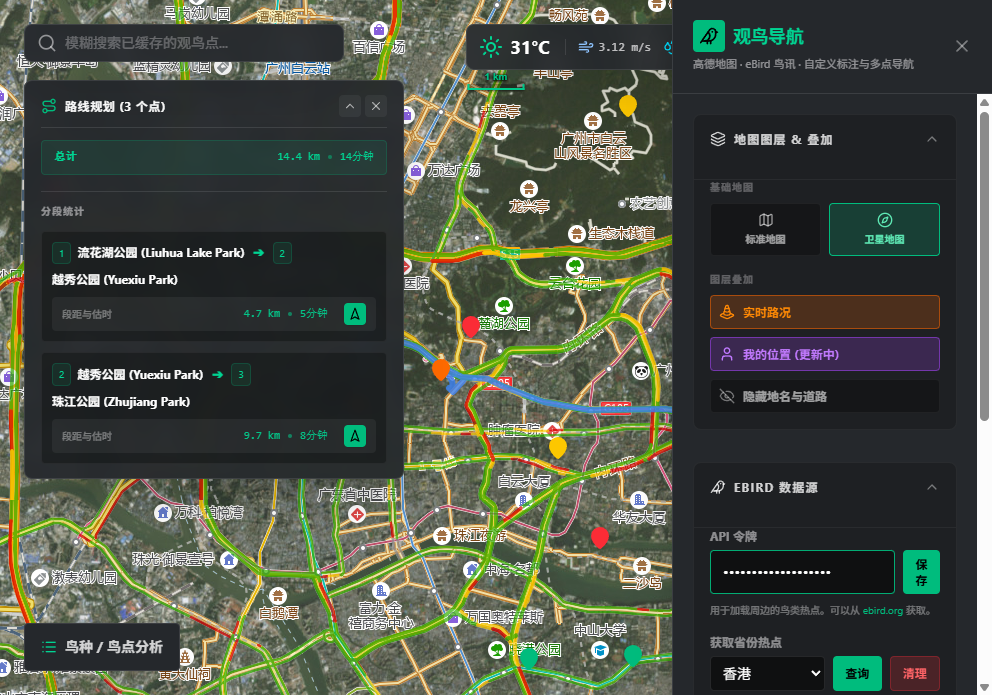
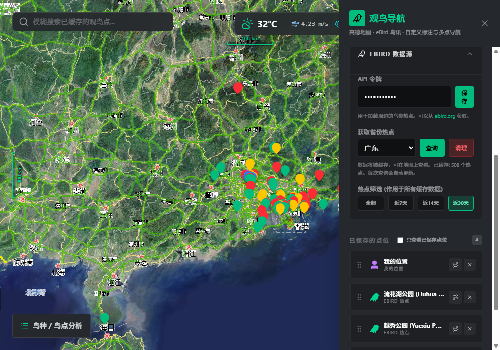
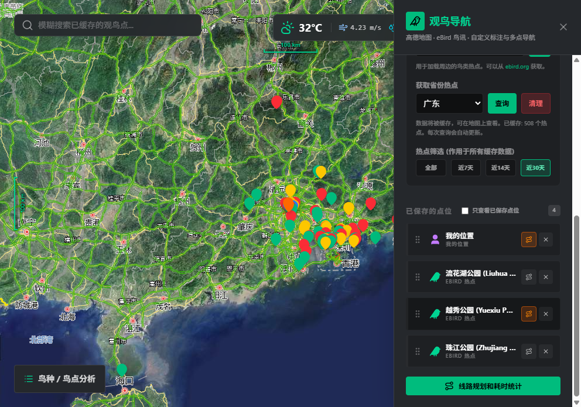
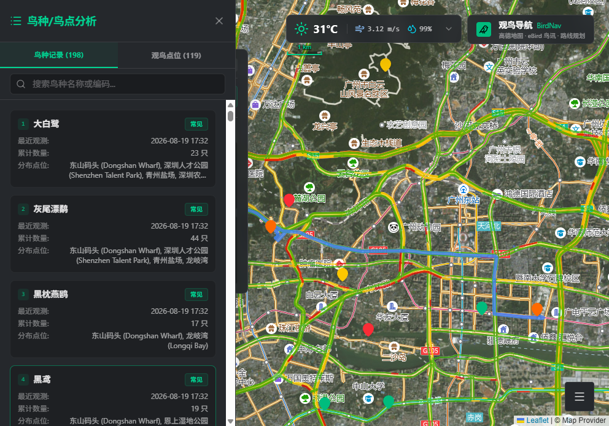

# 观鸟导航 BirdNav


[English](#english) | 中文

一个面向中国观鸟者的地图应用，用于发现 eBird 鸟类热点、整理观鸟点位并规划多点驾车路线。BirdNav 将高德地图图层、eBird 近期鸟讯、实时天气和常用导航应用串联在同一张地图中，让外出观鸟前的查点与行程安排更直接。

> 当前界面以中文呈现；本文档提供中英双语说明。

## 功能

- **热点探索**：按中国省级区域读取 eBird 热点与近 30 天观测记录，支持按最近 7、14、30 天或全部缓存记录筛选。
- **省份自动识别**：在浏览器已授予定位权限时优先使用 GPS；否则尝试根据 IP 推断中国省份。用户也可以手动选择省份。
- **热点搜索与收藏**：搜索已缓存热点，将 eBird 热点、自定义地图点击点和当前位置加入观鸟路线；可编辑名称、删除和拖拽排序。
- **多点路线**：使用 OSRM 计算驾车路线，展示总距离、总时长与逐段里程/耗时，并在地图上绘制路线。
- **外部导航**：从任意路线分段跳转至高德、百度、腾讯、Google 地图；在 iOS 上提供 Apple Maps 作为系统回退。
- **地图与叠加层**：提供高德道路/卫星底图、交通图层，以及卫星底图上的路网显示开关。
- **鸟讯分析**：查看缓存观测的鸟种与热点分析，并在地图上聚焦相关热点。
- **天气信息**：基于地图中心点显示当前气温、风速、降水概率和 7 日预报。
- **本地优先与 PWA**：偏好、已保存点位和已缓存鸟讯存于浏览器 IndexedDB；可安装为 PWA，并缓存 eBird 请求与高德地图瓦片以改善重复访问体验。

## 功能演示 / Featured Workflows

### 多点路线规划 / Multi-stop Route Planning



将热点或自定义点位加入行程后，可按访问顺序计算驾车路线，查看总里程、预计耗时、逐段统计，并从任一分段跳转至外部导航应用。

Add hotspots or custom stops to an itinerary, arrange their visit order, then review the driving route, total distance, estimated duration, and per-leg navigation hand-off.

### 设置与热点数据 / Settings and Hotspot Data



可在一个面板内切换地图图层、实时路况和当前位置，配置 eBird 数据源、加载省份热点并筛选缓存鸟讯。

Use one panel to change map layers, traffic, and location options; configure eBird, load provincial hotspots, and filter cached sightings.

### eBird 省份数据与时间筛选 / eBird Provincial Data and Recency Filters



选择省份后查询热点和近 30 天鸟讯；已缓存热点会显示数量。使用“全部、近 7 天、近 14 天、近 30 天”筛选可同时影响地图热点、搜索结果、鸟种/鸟点分析与已保存的 eBird 点位。需要重新获取时，可先清理当前省份的缓存数据。

Choose a province to load hotspots and recent sightings; the app displays the cached-hotspot count. The **All**, **7 days**, **14 days**, and **30 days** filters apply across map markers, search results, species/hotspot analysis, and saved eBird stops. Clear the current province's cache before loading a fresh result set when needed.

### 已保存点位与行程选择 / Saved Stops and Itinerary Selection



已保存点位支持自定义点、当前位置和 eBird 热点。拖动左侧手柄可调整顺序；通过点位右侧按钮选择或取消选择。选中至少两个点位后，“线路规划和耗时统计”按钮可用；“只查看已保存点位”会仅保留已保存热点在地图和分析结果中。

Saved stops can be custom locations, the current location, or eBird hotspots. Drag the left handle to reorder them, then use each stop's control to include or exclude it from the itinerary. Once at least two stops are selected, **Route Planning and Duration Statistics** becomes available. **Show saved stops only** restricts map and analysis results to saved hotspots.

### 鸟种与鸟点分析 / Species and Hotspot Analysis



基于已缓存的近期观测记录浏览鸟种、稀有度、数量、最近观测时间与分布点位，并可在地图上聚焦相关热点。

Explore cached sightings by species, rarity, count, latest observation time, and locations, then focus relevant hotspots on the map.

## 页面概览

启动应用后可直接在全屏地图工作区中完成热点探索、路线规划和数据管理。

主要区域：

1. **顶部**：缓存热点搜索、天气卡片和产品标识。
2. **地图画布**：热点标记、保存点位、路线折线以及底图控制。
3. **路线面板**：多点路线的汇总、分段统计及外部导航入口。
4. **右侧设置**：地图图层、交通/路网叠加、eBird Token、省份数据加载与热点时间筛选。
5. **鸟种 / 鸟点分析**：从左下角入口查看已缓存鸟讯和热点统计。

## 快速开始

### 环境要求

- Node.js 18 或更高版本
- npm 9 或更高版本
- 一个 eBird API Token（加载热点和近期观测时必需）

### 安装与启动

```bash
git clone https://github.com/HuangZhilue/BirdNav.git
cd BirdNav
npm install
npm run dev
```

开发服务器默认监听 `http://localhost:3000`。如需在局域网设备上访问，可使用终端打印出的网络地址。

### 生产构建

```bash
npm run lint
npm run build
npm run preview
```

`lint` 执行 TypeScript 类型检查；`build` 产出静态站点文件；`preview` 在本地预览构建结果。

## 使用指南

### 1. 配置 eBird

1. 打开右下角的“设置与数据管理”。
2. 在“eBird 数据源”中粘贴 Token，点击保存。
3. Token 可在 [eBird API Key Generator](https://ebird.org/api/keygen) 获取。
4. 选择省份并加载数据。应用会请求该区域的热点与近 30 天观测并缓存到浏览器。

Token 仅保存在当前浏览器的 IndexedDB 中，不会写入仓库、构建产物或服务器环境变量。不要在截图、提交记录或公共问题中暴露自己的 Token。

### 2. 查找与筛选热点

- 在顶部搜索框中按名称模糊检索**已缓存**的热点。
- 在设置面板选择省份后点击“查询”，即可缓存该省的热点与近 30 天鸟讯；“清理”会移除当前省份的缓存热点和分析记录。
- 在设置面板选择“全部、近 7 天、近 14 天、近 30 天”。热点图钉按最近观测日期着色：红色为 7 天内、黄色为 14 天内、绿色为 30 天内、灰色为更早或无日期。
- 筛选会同步作用于地图、搜索结果、鸟种/鸟点分析和已保存的 eBird 点位；可勾选“只查看已保存点位”以专注当前行程。

### 3. 创建观鸟路线

1. 点击地图添加自定义点，或从热点搜索/标记中加入 eBird 点位。
2. 在“已保存的点位”列表中拖动手柄调整访问顺序；点位也可重命名或删除。
3. 点击每个点位右侧的选择按钮，将其纳入或移出本次行程。
4. 选中至少两个点位后，点击“线路规划和耗时统计”计算路线并展示统计信息。
5. 点击分段右侧的导航按钮，在已安装的地图应用或浏览器中继续导航。

### 4. 调整地图与天气

- 在设置中切换道路或卫星底图，按需启用交通图层和卫星路网。
- 移动地图后，天气组件会根据地图中心位置刷新。展开天气卡片可查看 7 日预报。

## 数据、隐私与服务说明

| 服务 | 用途 | 说明 |
| --- | --- | --- |
| [eBird API](https://documenter.getpostman.com/view/664302/S1ENwy59) | 热点与近期观测 | 需要用户提供 Token；服务配额和数据可用性由 eBird 决定。 |
| 高德地图瓦片 | 道路、卫星、交通与路网图层 | 图层数据与可用性由地图服务提供方决定。 |
| [OSRM](https://project-osrm.org/) | 多点驾车路线 | 距离与耗时为路线服务的估计值，应以实际道路与交通状况为准。 |
| [Open-Meteo](https://open-meteo.com/) | 当前天气与 7 日预报 | 天气结果随地图中心位置刷新。 |
| 浏览器定位、反向地理编码与 IP 地理定位 | 推荐中国省份 | 自动识别可能因权限、网络或位置精度而失败，手动选择始终可用。 |

除第三方服务请求外，应用不包含自建后端。保存点位、地图偏好、eBird Token 和缓存数据保存在使用者的浏览器本地存储中。清除站点数据或使用不同浏览器/设备后，需要重新配置并重新缓存数据。

## 技术栈

- React 19 + TypeScript
- Vite 6 + Tailwind CSS 4
- Leaflet + React Leaflet
- `@dnd-kit`：路线点位排序
- `idb-keyval`：IndexedDB 本地持久化
- `vite-plugin-pwa` + Workbox：PWA 注册与运行时缓存
- Lucide React：界面图标

## 项目结构

```text
src/
  App.tsx                    # 应用入口与状态提供者
  components/
    MapComponent.tsx          # 地图、热点、路线、设置与分析界面
    WeatherWidget.tsx         # 当前天气与 7 日预报
  store/StoreContext.tsx      # 本地状态和 IndexedDB 持久化
  utils/
    coords.ts                 # WGS84 / GCJ-02 坐标转换
    geolocation.ts            # 省份自动识别
    provinces.ts              # 中国省份与地图视图配置
  types.ts                    # 领域类型定义
```

## 已知限制

- 热点搜索仅搜索已下载到本地缓存的数据；请先在设置中加载相应省份。
- eBird 的近期观测接口受数据范围和服务限制影响，部分热点可能没有可展示的详细鸟种列表。
- 路线服务需要网络连接，且路线估算不等同于实时导航；出行前请在所选导航应用中复核。
- 应用的主要地图与省份体验面向中国大陆及 eBird 所支持的中国区域；其他地区的行为取决于外部服务。

## 贡献

欢迎提交 Issue 和 Pull Request。建议在提交前运行：

```bash
npm run lint
npm run build
```

请勿提交 eBird Token、个人定位记录或不应公开的热点信息。

---

## English

[中文](#观鸟导航-birdnav) | English

BirdNav is a map-first tool for birders in China. It helps you discover eBird hotspots, organize birding stops, and plan multi-stop driving routes. The application brings Gaode map layers, eBird sightings, local weather, and hand-off navigation together in one map workspace.

> The current interface is in Simplified Chinese. This README is available in both Chinese and English.

## Features

- **Hotspot discovery**: load eBird hotspots and sightings from the past 30 days by Chinese provincial region; filter cached records by 7, 14, 30 days, or all data.
- **Province detection**: prefer already-permitted GPS coordinates and otherwise try IP-based province detection; manual province selection remains available.
- **Search and saved stops**: search cached hotspots and add eBird hotspots, map-clicked custom points, or your current location to a route. Stops can be renamed, removed, and reordered by drag and drop.
- **Multi-stop routing**: calculate driving routes with OSRM, including total and per-leg distance/time, and display the route on the map.
- **External navigation**: hand off any route segment to Amap, Baidu Maps, Tencent Maps, or Google Maps, with Apple Maps as an iOS fallback.
- **Map layers**: switch between Gaode road and satellite maps, with optional traffic and satellite road-network overlays.
- **Birding analysis**: review cached bird observations and hotspot summaries, then focus matching hotspots on the map.
- **Weather**: show conditions at the map center, including temperature, wind, precipitation probability, and a seven-day forecast.
- **Local-first PWA**: preferences, saved stops, and cached bird data live in browser IndexedDB. The app can be installed as a PWA and caches eBird requests and Gaode map tiles for repeat visits.

## Interface At A Glance

When launched, BirdNav opens directly into a full-screen map workspace for discovery, routing, and data management.

1. **Top bar**: cached-hotspot search, weather, and app identity.
2. **Map canvas**: hotspots, saved stops, route lines, and map controls.
3. **Route panel**: multi-stop summary, leg statistics, and navigation hand-off.
4. **Settings panel**: map layers, traffic/road overlays, eBird Token, provincial data loading, and time filters.
5. **Bird/species analysis**: access cached sighting and hotspot summaries from the lower-left control.

## Quick Start

### Prerequisites

- Node.js 18 or later
- npm 9 or later
- An eBird API Token, required to load hotspots and recent observations

### Install and run

```bash
git clone https://github.com/HuangZhilue/BirdNav.git
cd BirdNav
npm install
npm run dev
```

The development server listens on `http://localhost:3000` by default. Use the network URL printed by Vite to open it from another device on the same network.

### Production build

```bash
npm run lint
npm run build
npm run preview
```

`lint` runs the TypeScript type check, `build` creates the static production output, and `preview` serves that output locally.

## How To Use

### 1. Configure eBird

1. Open **Settings and Data Management** in the lower-right corner.
2. Paste your token under **eBird Data Source** and save it.
3. Get a token from the [eBird API Key Generator](https://ebird.org/api/keygen).
4. Choose a province and load its data. BirdNav requests hotspots and sightings from the last 30 days, then caches them in the browser.

The token is stored only in the current browser's IndexedDB. It is not added to the repository, build output, or server-side environment. Do not expose it in screenshots, commits, or public issues.

### 2. Find and filter hotspots

- Use the top search field for fuzzy matching across **cached** hotspots.
- Choose a province and select **Query** in settings to cache its hotspots and sightings from the previous 30 days. **Clear** removes cached hotspots and analysis records for the current province.
- Select **All**, **7 days**, **14 days**, or **30 days** in settings. Markers are colored by their latest observation date: red within 7 days, yellow within 14 days, green within 30 days, and gray for older or undated data.
- The filter applies to the map, search results, species/hotspot analysis, and saved eBird stops. Enable **Show saved stops only** to focus on the current itinerary.

### 3. Build a birding route

1. Click the map to add a custom stop, or add an eBird stop from a search result or marker.
2. Drag a stop's handle in **Saved Stops** to choose the visit order; rename or remove stops as needed.
3. Use each stop's selection control to include or exclude it from the current itinerary.
4. When at least two stops are selected, select **Route Planning and Duration Statistics** to calculate the driving route and statistics.
5. Use a segment's navigation button to continue in an installed maps app or browser.

### 4. Tune the map and weather

- Switch road/satellite maps in settings and enable traffic or satellite road-network overlays as needed.
- Weather refreshes for the map center after moving the map. Expand the weather card for the seven-day forecast.

## Data, Privacy, and External Services

| Service | Purpose | Notes |
| --- | --- | --- |
| [eBird API](https://documenter.getpostman.com/view/664302/S1ENwy59) | Hotspots and recent observations | Requires a user-provided token; quotas and availability are controlled by eBird. |
| Gaode map tiles | Road, satellite, traffic, and road-network layers | Map content and availability are controlled by the provider. |
| [OSRM](https://project-osrm.org/) | Multi-stop driving routes | Distance and duration are estimates; confirm current conditions in your navigation app. |
| [Open-Meteo](https://open-meteo.com/) | Current conditions and seven-day forecast | Results refresh using the map center. |
| Browser geolocation, reverse geocoding, and IP geolocation | Province recommendation | Detection can fail because of permissions, network conditions, or accuracy; manual selection is always available. |

BirdNav has no application-owned backend. Apart from requests to the external services above, saved stops, map preferences, eBird Token, and cached data remain in the user's local browser storage. Clearing site data or switching browsers/devices requires configuration and caching again.

## Tech Stack

- React 19 and TypeScript
- Vite 6 and Tailwind CSS 4
- Leaflet and React Leaflet
- `@dnd-kit` for route-stop sorting
- `idb-keyval` for IndexedDB persistence
- `vite-plugin-pwa` and Workbox for PWA registration and runtime caching
- Lucide React for UI icons

## Project Structure

```text
src/
  App.tsx                    # App entry point and state provider
  components/
    MapComponent.tsx          # Map, hotspots, routing, settings, and analysis UI
    WeatherWidget.tsx         # Current conditions and seven-day forecast
  store/StoreContext.tsx      # Local state and IndexedDB persistence
  utils/
    coords.ts                 # WGS84 / GCJ-02 coordinate conversion
    geolocation.ts            # Province detection
    provinces.ts              # Chinese provinces and map views
  types.ts                    # Domain type definitions
```

## Known Limitations

- Hotspot search only covers data that has been downloaded into the local cache. Load the relevant province first.
- The eBird recent-observations endpoint is subject to data coverage and service restrictions; some hotspots may not have a detailed recent species list.
- Routing requires network access and provides estimates, not live navigation. Review the route in the selected navigation application before travel.
- The main map and provincial workflow target mainland China and Chinese regions supported by eBird. Behavior elsewhere depends on the external services.

## Contributing

Issues and pull requests are welcome. Before submitting changes, run:

```bash
npm run lint
npm run build
```

Do not commit eBird Tokens, private location history, or hotspot data that should not be public.
